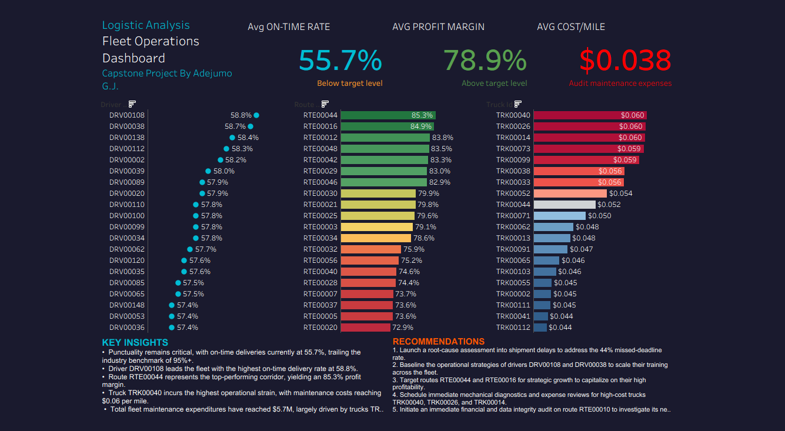

# Logistics Operations Analysis

A full end-to-end data analysis capstone project on a logistics operations 

database with 14 tables and 85,000+ trip records.

## Tools Used

- Python (pandas, matplotlib, seaborn) — data cleaning and analysis

- Tableau Public — interactive dashboard

- Jupyter Notebook — development environment

- GitHub — version control

## Dashboard

🔗 [View Live Dashboard](https://drive.google.com/file/d/16-NORVOQ4RXyIYwA8StOSFCRukLfo4mh/view?usp=sharing)

## Key Findings

- Fleet on-time rate: **55.7%** vs. 95%+ industry benchmark

- Top driver **DRV00108** achieves **58.8%** on-time delivery rate

- Most profitable route **RTE00044** delivers **85.3%** profit margin

- **TRK00040** has highest maintenance cost at **$0.06/mile**

- Total fleet maintenance spend: **$5.7M**

- **RTE00010** has a negative **609% margin** — pricing or data quality issue

## Project Structure

| Folder / File | Description |

|---|---|

| `data/` | Raw CSV files — 14 tables |

| `notebooks/01_data_exploration.ipynb` | Load all 14 tables, check nulls, verify FK relationships |

| `notebooks/02_cleaning.ipynb` | Fix nulls, convert data types, export clean CSVs |

| `notebooks/03_analysis.ipynb` | Driver performance, route profitability, fleet health |

| `exports/` | Clean CSVs and chart PNGs |

## Notebooks

| Notebook | Description |

|---|---|

| 01_data_exploration | Load all 14 tables, check nulls, verify FK relationships |

| 02_cleaning | Fix nulls, convert data types, export clean CSVs |

| 03_analysis | Driver performance, route profitability, fleet health |
